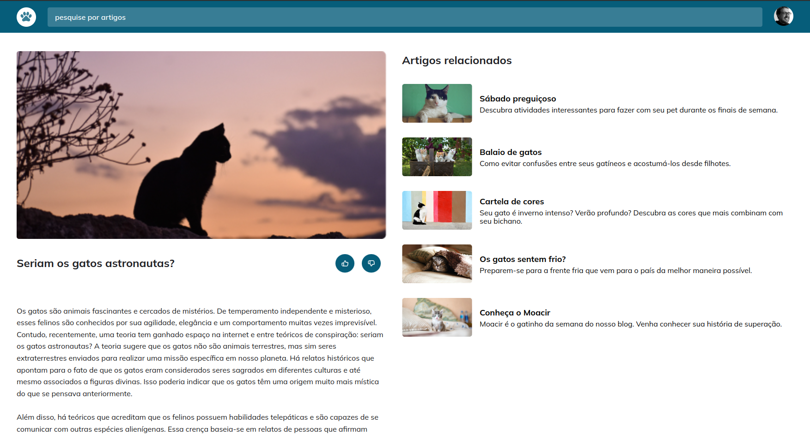
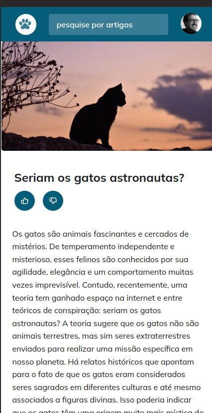

# Blog de Gatos 

Resolução do desafio de criar um blog com tema de gatos. A página é estática, mas possui algumas animações relacionadas a imagem principal do site e os artigos. O layout é responsivo, se adequa a celulares e dispositivos convencionais como computadores e notebooks.

Layout desktop:

  

Layout Mobile:

  

Esse projeto foi desenvolvido com as seguintes tecnologias:

- HTML e CSS
- Git e Github
- Figma

